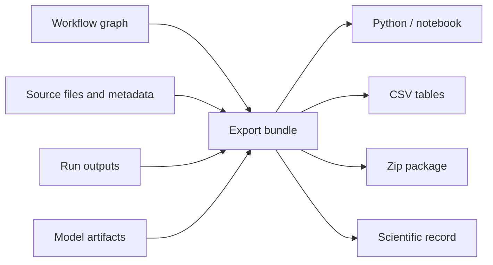

# Export Design

Exports should preserve both values and context.

## What Export Is For

Export is the handoff from interactive analysis to another person, system, or record. A useful export should let someone understand what data was used, what workflow ran, what parameters were chosen, what outputs were produced, and what limitations remain.



## Useful Export Context

- workflow name and version
- run timestamp
- node parameters
- sample IDs
- target names and units
- metric names and split design
- model artifact identifiers
- source file names and extensions

## Example Export Bundle

A good zip export for a PLS calibration might look like:

```text
pls_moisture_calibration_export/
├── manifest.json
├── workflow.json
├── data/
│   ├── spectra.csv
│   └── targets.csv
├── outputs/
│   ├── predicted_vs_measured.csv
│   ├── metrics.json
│   ├── vip_scores.csv
│   └── coefficients.csv
├── figures/
│   ├── predicted_vs_measured.png
│   └── vip_scores.png
└── model/
    ├── manifest.json
    └── arrays/
        ├── coef.npy
        ├── x_mean.npy
        └── x_scale.npy
```

The important part is not the exact folder names. The important part is that values travel with their context: sample IDs, units, axis definitions, workflow parameters, validation split, and source file names.

## Python and Notebook Exports

Where Python export is supported, it should reproduce the workflow with explicit parameters and clear data-source binding. Unsupported nodes should fail visibly rather than pretending to export.

For example, an exported preprocessing step should look like an explicit operation:

```python
spectra = load_dataset("data/spectra.csv")
spectra_snv = snv(spectra)
spectra_deriv = savgol_derivative(spectra_snv, window_length=15, polyorder=2)
```

It should not silently depend on UI state, hidden session data, or a database row that another user cannot access.

## Portable `.sherpa` Objects

The `.sherpa` object is the round-trip export path for moving a project between SpectraSherpa installs. It is a ZIP container with:

- `sherpa-object.json`: object version, package mode, payload inventory, SHA-256 hashes, and project summary
- `project.json`: project snapshot with data sources, workflow sheets, nodes, edges, scripts, and model references
- `models/<artifact_uid>/manifest.json` and `models/<artifact_uid>/arrays.npz` when saved model artifacts are available

Unlike a Python or notebook export, a `.sherpa` object is meant to be imported back into SpectraSherpa. Import creates a new project, restores project data-source records, recreates workflow sheets with their nodes and edges, imports model artifacts when present, and stores the imported payload as version 1 of the new project.

The object can be inspected or validated without executing workflows:

```bash
spectra-sherpa object inspect project.sherpa
spectra-sherpa object validate project.sherpa
```

For a running local or hosted API, the CLI can also call the project object endpoints:

```bash
spectra-sherpa object export 42 project.sherpa
spectra-sherpa object import project.sherpa
```

Hosted APIs that require authentication can pass `--api-url` and `--token`.

The current package mode is `full`. A future metadata-only mode is scaffolded in the manifest but is not yet a supported export option.

Compatibility policy: the beta object reader currently accepts only exact object-version `0.1`. Treat this as the first implementation contract, not a long-term compatibility promise. Future object revisions should add an explicit min/max reader range before changing the manifest schema.

## Extension Pattern

Use export extensions when a lab or partner needs a specific handoff format:

- regulated report packet
- LIMS-friendly CSV tables
- instrument-method transfer package
- model-review archive
- customer-facing PDF/HTML report bundle

The extension should state which node outputs it supports and what metadata is required. If required metadata is missing, export should fail clearly and explain what the user must add.
