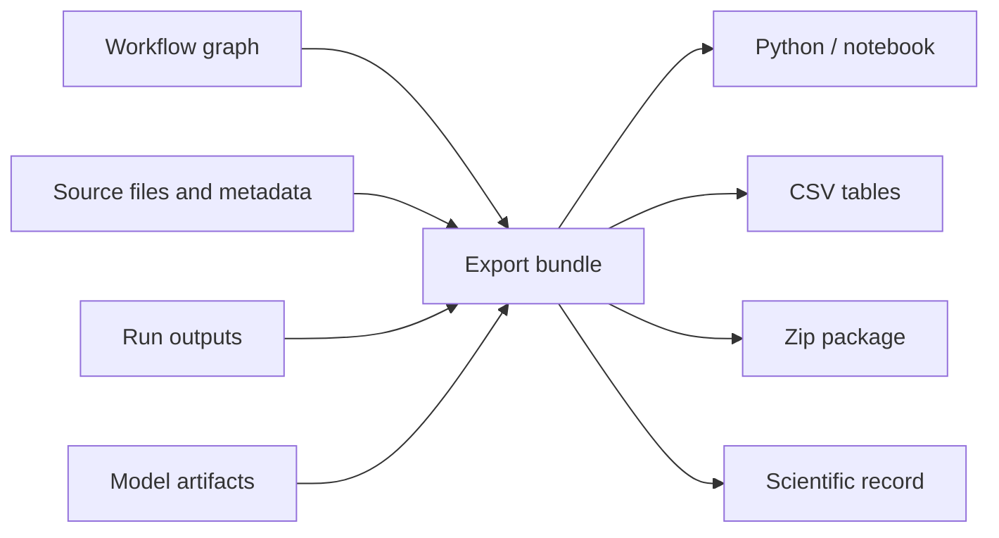

# Export Design

Exports should preserve both values and context.

## What Export Is For

Export is the handoff from interactive analysis to another person, system, or record. A useful export should let someone understand what data was used, what workflow ran, what parameters were chosen, what outputs were produced, and what limitations remain.


```mermaid
flowchart LR
    W[Workflow graph] --> B[Export bundle]
    D[Source files and metadata] --> B
    R[Run outputs] --> B
    M[Model artifacts] --> B
    B --> P[Python / notebook]
    B --> C[CSV tables]
    B --> Z[Zip package]
    B --> S[Scientific record]
```

## Useful Export Context

- workflow name and version
- run timestamp
- node parameters
- sample IDs
- target names and units
- metric names and split design
- model artifact identifiers
- source file names and extensions

## Example Export Bundle

The following is an illustrative layout, not a promise that every export
format emits these members. A PLS calibration record might contain:

```text
pls_moisture_calibration_export/
├── manifest.json
├── workflow.json
├── data/
│   ├── spectra.csv
│   └── targets.csv
├── outputs/
│   ├── predicted_vs_measured.csv
│   ├── metrics.json
│   ├── vip_scores.csv
│   └── coefficients.csv
├── figures/
│   ├── predicted_vs_measured.png
│   └── vip_scores.png
└── model/
    ├── manifest.json
    └── arrays/
        ├── coef.npy
        ├── x_mean.npy
        └── x_scale.npy
```

The important part is not the exact folder names. The important part is that values travel with their context: sample IDs, units, axis definitions, workflow parameters, validation split, and source file names.

## Python and Notebook Exports

Supported Python and notebook exports describe the current workflow graph with
explicit parameters and data-source bindings. They are not historical-run replay
exports. Restoring a workflow version and executing it creates a new run; retained
parameters alone cannot guarantee the same source data or runtime. Unsupported
nodes and unavailable retained evidence must be reported explicitly.

Current exports preserve both single-file and selected collection sources.
Ordinary customer or local files are copied into the export's `data/`
directory and can be relocated by setting `SHERPA_DATA_DIR`. A collection
retains its exact selected members, scientist-defined sample table, target,
and validation-group choice. User-acquired registered-reference bytes are not
redistributed; set `SPECTRA_REFERENCE_DIR` to the exact downloaded member or
to a bounded directory containing exactly one size-and-SHA match. The filename
and absolute directory are never scientific authorities.

For example, an exported preprocessing step should look like an explicit operation:

```python
spectra = load_dataset("data/spectra.csv")
spectra_snv = snv(spectra)
spectra_deriv = savgol_derivative(spectra_snv, window_length=15, polyorder=2)
```

It should not silently depend on UI state, hidden session data, or a database row that another user cannot access.

## Portable `.sherpa` Objects

The `.sherpa` object is the round-trip export path for moving a project between SpectraSherpa installs. It is a ZIP container with:

- `sherpa-object.json`: object version, package mode, payload inventory, SHA-256 hashes, and project summary
- `project.json`: project snapshot with data sources, workflow sheets, nodes, edges, scripts, and model references
- `data/experiments/<id>/...`: uploaded project files needed by My Dataset workflows
- `models/<artifact_uid>/manifest.json` and `models/<artifact_uid>/arrays.npz` when saved model artifacts are available

Current full-project exports mark `project.json` with `archive_format.version: "0.2"` and mirror that value in `sherpa-object.json` as `project_payload_version`. Uploaded data files use deterministic member paths derived from their experiment ID and relative file path. During import, a bundled file is accepted only when the project payload's `archive_member` matches that deterministic path and the file's SHA-256 matches the recorded `sha256`.

Unlike a Python or notebook export, a `.sherpa` object is meant to be imported back into SpectraSherpa. Import creates a new project, restores uploaded project files and their metadata, restores project data-source records, recreates workflow sheets with their nodes and edges, imports model artifacts when present, and stores the imported payload as version 1 of the new project.

The object can be inspected or validated without executing workflows:

```bash
spectra-sherpa object inspect project.sherpa
spectra-sherpa object validate project.sherpa
```

For a running local or hosted API, the CLI can also call the project object endpoints:

```bash
spectra-sherpa object export 42 project.sherpa
spectra-sherpa object import project.sherpa
```

Hosted APIs that require authentication can pass `--api-url` and `--token`.

The current package mode is `full`. A future metadata-only mode is scaffolded in the manifest but is not yet a supported export option.

Import keeps the normal per-file upload cap for each restored data or model member. A full project archive can be larger than a single file because it may include several uploaded files plus model artifacts; the current aggregate uncompressed archive budget is ten times the configured single-file upload limit.

Compatibility policy: the beta object reader currently accepts only exact object-version `0.1`; project payload revisions are distinguished by `project_payload_version`. Treat this as the first implementation contract, not a long-term compatibility promise. Future object revisions should add an explicit min/max reader range before changing the manifest schema.

## Signed Campaign Review Packages and local application

A managed campaign's signed review package is a different delivery contract from
the full-project object described above, even when both use the `.sherpa`
extension. It carries the supported selected application and retained review
evidence. Download its publisher verification keys from the trusted managed
service, verify/import the package in local OSS, then configure **Deploy → New
Watch** for compatible incoming files.

This handoff supports local inference without a paid account. It does not export
the managed optimizer or promise reconstruction of every campaign candidate.
Package verification, model/input compatibility, and scientific applicability
are separate checks. Qualification records and report-only QC do not establish
fitness for a new instrument or population without the required evidence.

For non-redistributed reference sources, recipients supply their own exact
provider-obtained file when reproducing work that needs that source. Ordinary
customer files may be included when the selected export and deployment policy
permit it. Neither package signing nor a scientific checksum grants data rights.

## Extension Pattern

Use export extensions when a lab or partner needs a specific handoff format:

- regulated report packet
- LIMS-friendly CSV tables
- instrument-method transfer package
- model-review archive
- customer-facing PDF/HTML report bundle

The extension should state which node outputs it supports and what metadata is required. If required metadata is missing, export should fail clearly and explain what the user must add.
