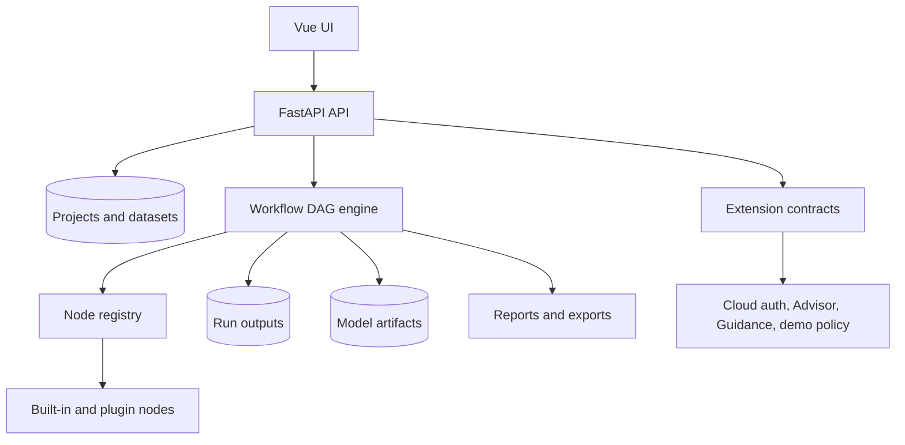

# System Overview

SpectraSherpa is a local-first spectroscopy platform with extension points for hosted services.

## Main Layers

- **Vue frontend**: the browser UI for Data, Workflows, Reports, Admin/Cloud surfaces, and interactive plots.
- **FastAPI backend**: project, dataset, workflow, model, export, and local API routes.
- **Workflow DAG engine**: executes connected nodes in dependency order and records run outputs.
- **Node registry**: discovers built-in and plugin nodes with declared inputs, outputs, parameters, and policies.
- **SherpaDataset data model**: the concrete runtime object for spectral arrays, axes, sample metadata, processing history, targets, and role information. Node tables may call spectral ports `SpectralDataset`; that is the semantic port contract for spectra carried inside a `SherpaDataset`.
- **Model artifact store**: persists trained calibrations/classifiers with enough metadata to review and reapply them later.
- **Export layer**: turns workflows, plots, tables, and model records into portable files.
- **Optional extension contracts**: allow Cloud, AI providers, plugins, auth, and deployment policy to attach without rewriting the OSS core.

## OSS and Cloud Boundary

The OSS package owns the scientific platform and extension contracts. Cloud adds managed service behavior through server-side extensions and deployment configuration. The cloud docs describe hosted usage; developer implementation details belong under OSS Developers and Architecture.

This boundary is important for users and builders:

- Local OSS users get the spectroscopy workbench, workflow engine, node library, local projects, local model artifacts, exports, and optional BYOK chat support.
- Enterprise/demo Cloud users get the managed browser deployment, account policy, centrally configured AI, Sherpa Advisor, Ambient Guidance, demo limits, and collaboration surfaces.
- Developers can build above the OSS layer by adding nodes, exporters, providers, or deployment-specific extensions instead of forking the whole app.

## Example: One Analysis Moving Through the System

1. A user imports FTIR or NIR files in the Data view.
2. The backend stores the dataset and records file names, extensions, metadata, and the data matrix.
3. The user starts a PCA or PLS template in the Workflow Builder.
4. The DAG engine executes each node and passes `SherpaDataset` objects through the graph.
5. Output nodes render scores plots, predicted-vs-measured plots, tables, metrics, and reports.
6. If the model is worth keeping, the model store persists the fitted state plus a readable manifest.
7. Export creates a portable record of the workflow, parameters, source context, and outputs.

That path is the core product promise: scientists can see what came in, what happened to it, what was computed, and what was exported.
