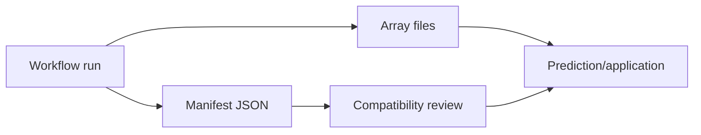

# Model Artifacts

Model artifacts persist trained models. They are the bridge between "this workflow run looked good" and "this calibration or classifier can be reviewed, versioned, reapplied, or handed to another system."

## What a Model Artifact Is

For a PLS calibration, the artifact should answer practical questions such as:

- What dataset and target was used?
- What preprocessing and parameters were applied?
- What spectral axis and feature count does the model expect?
- Which fitted arrays are needed to predict new spectra?
- What validation metrics justified saving it?
- Which run, user, project, and timestamp produced it?

## Stored Form

SpectraSherpa stores model artifacts as **readable metadata plus numeric state**.

The readable part is a manifest. Think of it as the model's label, recipe, and compatibility contract:

```json
{
  "artifact_type": "pls_regression",
  "created_from_run": "run_2026_06_05_001",
  "target": {"name": "moisture", "units": "%"},
  "spectral_axis": {"units": "cm^-1", "n_features": 1557},
  "preprocessing": ["snv", "savgol_derivative"],
  "metrics": {"rmsep": 0.18, "r2": 0.94, "bias": -0.02},
  "arrays": ["x_mean.npy", "x_scale.npy", "coef.npy", "loadings.npy"]
}
```

The numeric state files hold values that should not be hand-edited: regression coefficients, loadings, scaling vectors, class centers, or other fitted arrays. Keeping this fitted state alongside a readable manifest makes the artifact both reviewable by humans and precise enough for later application.



## Why They Matter

A calibration or classifier is useful only if it can be reapplied to compatible spectra. The artifact should carry enough contract information to explain what the model expects, why it was saved, and what has to match at apply time.

## Apply-Time Review

Before applying a model, confirm spectral axis, preprocessing, feature count, and units match the training data.

For example, a PLS model trained on absorbance spectra from 4000-650 cm^-1 should not be applied blindly to transmittance spectra, truncated axes, different resolution, or spectra preprocessed outside the saved workflow contract.
