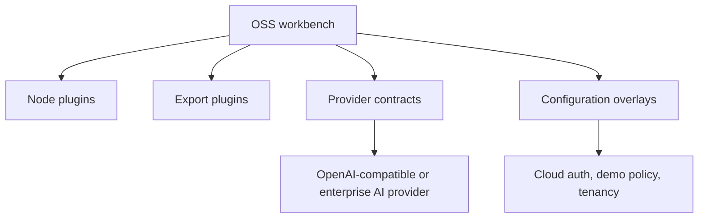

# Plugins and Extension Points

SpectraSherpa exposes extension points without requiring forks.

## Why Extensions Matter

SpectraSherpa should be a platform a lab can build above. A spectroscopy group may need a proprietary preprocessing method, an instrument-specific loader, a regulated export packet, or a private AI provider. The intended path is to add a narrow extension with explicit contracts, not to rewrite the workbench.

## OSS Extension Surfaces

- node registration
- workflow tools
- AI provider contract
- public path provider
- configuration overlays
- authentication and demo-policy contracts for server extensions



## Plugin Nodes

Plugin nodes can add new loaders, preprocessing transforms, models, or outputs. A plugin should declare clear ports and data-role expectations so the workflow builder can reject unsafe wiring.

### Example: Add a Simple Spectral Transform

For common dataset-in/dataset-out transforms, OSS authors can use the public node-authoring facade. The example below adds a simple absorbance offset correction node.

```python
import numpy as np

from spectra_sherpa.sdk_nodes import ChemometricsNode, param_number


class OffsetCorrection(ChemometricsNode):
    node_type = "plugin.offset_correction"
    category = "preprocessing"
    label = "Offset Correction"
    description = "Subtract a constant offset from every spectrum."
    parameters = [
        param_number(
            "offset",
            default=0.0,
            label="Offset",
            description="Constant value subtracted from the data matrix.",
        )
    ]
    numpy_expr = "data - {offset}"

    def process(self, dataset, offset: float = 0.0):
        return np.asarray(dataset.data, dtype=float) - offset
```

A production plugin should also include tests that prove:

- the node appears in the expected palette category
- it rejects incompatible input data
- the output preserves spectral axis and sample metadata
- Python export either reproduces the transform or fails visibly

### Example: Add a New Output Node

An output node can create a lab-specific table, a CSV bundle, a QA summary, or an instrument handoff file. The key design rule is the same as for modeling nodes: declare what the node consumes and what it emits. If the output requires sample IDs, target units, or a spectral axis, make that requirement explicit instead of accepting any array.

## Hosted Extensions

Cloud features such as managed auth, Advisor, guidance, and demo policy are provided outside the OSS package through extension contracts. Cloud extensions must keep proprietary behavior outside the OSS package while preserving the public contracts that make local and hosted workflows understandable.
