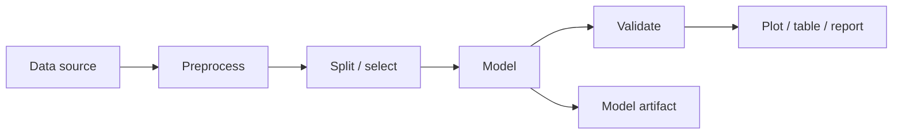

# Workflow Execution

SpectraSherpa workflows are directed graphs.

## Execution Flow

1. Data nodes load or materialize datasets.
2. Transform nodes preprocess or select variables.
3. Model nodes fit or apply estimators.
4. Validation nodes compute metrics.
5. Output nodes render plots, tables, summaries, and exports.

## Port Semantics

Nodes declare input and output ports. Good workflow behavior depends on these declarations matching scientific meaning, not only runtime Python shapes.

For example, a PLS node's `X` input expects spectra or feature data, while its `y` input expects target values. Both may be arrays at runtime, but they are not scientifically interchangeable. Port contracts are what let the UI reject dangerous wiring before a user trains a model on the wrong thing.

## Reproducibility

Workflow runs capture parameters and outputs so results can be revisited. Model artifacts store fitted model state separately from the interactive run.

Useful run records include:

- input dataset identifiers and source file names
- node versions and parameters
- preprocessing steps in order
- validation split or cross-validation design
- primary plots, tables, and metrics
- model artifact identifiers

This is how SpectraSherpa turns a visual workflow into a reviewable scientific record.
