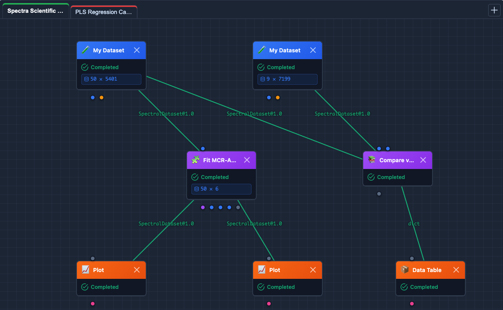

# SpectraSherpa

SpectraSherpa is a free open-source spectroscopy workbench for building reproducible analysis workflows. The current release is centered on **FTIR, NIR, Raman, and UV-VIS spectroscopy**: import files, inspect the data matrix, track provenance, preprocess spectra, run chemometrics, save models, and export results.

<figure class="ss-hero-figure">
  
</figure>

## Choose Your Path

| Goal | Start Here |
| --- | --- |
| Install and run on your computer | [30 Minutes to Local Compute](onboarding/local-30-minutes.md) |
| Bring in your first dataset | [Import Your First Dataset](onboarding/import-first-dataset.md) |
| Compare cloud and local OSS | [Cloud vs Local OSS](introduction/cloud-vs-local.md) |
| Check supported formats | [Supported File Types](introduction/file-types.md) |
| See what is built today | [Current Capabilities](introduction/capabilities.md) |
| Extend the project | [Developer Setup](developers/setup.md) and [Writing a Plugin Node](developers/plugin-node.md) |

## Two Ways to Run

- **Local OSS** runs on your own machine with no login. You can inspect and modify the source, load your own data without hosted demo limits, and add optional extras for vendor readers or HITRAN/HAPI synthesis.
- **SpectraSherpa Cloud** is the hosted enterprise/demo experience. It adds managed accounts, demo policy, Sherpa Advisor, and Ambient Guidance for users who want to evaluate the workflow in a browser.

## What Is Built Today

SpectraSherpa combines a visual workflow builder, spectroscopy-aware data handling, import transparency, preprocessing, PCA, PLS, classification, SIMCA QC, MCR-ALS, peak/library workflows, model artifacts, reports, exports, NIST reference data, optional HITRAN/HAPI synthesis, and optional SpectroChemPy-backed vendor file support. The detailed scope is maintained in [Current Capabilities](introduction/capabilities.md).

## Scientific Foundations

SpectraSherpa builds on scientific software and data resources maintained by the broader community, including [SpectroChemPy](attributions/spectrochempy.md), [NIST](attributions/nist.md), [HITRAN/HAPI](attributions/hitran.md), NumPy, SciPy, pandas, and scikit-learn. Cite upstream resources when they contribute to your analysis, and review [License](introduction/license.md) before redistribution or hosted use.
