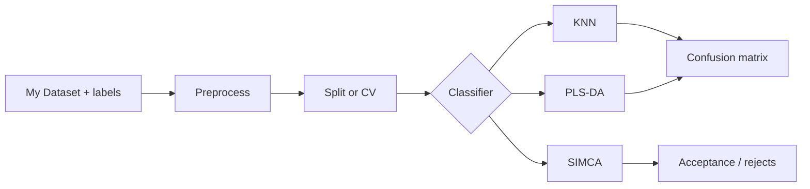

# Classification Starters

Classification starters cover KNN, PLS-DA, and SIMCA workflows.

## When To Use Them

Use classification templates when spectra have categorical labels: material identity, pass/fail class, supplier, process state, instrument condition, or QC acceptance group.

Good starting data:

- spectra with labels that are scientifically meaningful
- enough samples per class for validation
- known replicate or batch structure
- a clear choice between forced classification and acceptance/rejection

## End-to-End Workflow

1. Import spectra and class labels, then verify sample IDs and label names.
2. Use PCA first if class separation or outliers are unknown.
3. Pick the classifier that matches the scientific decision.
4. Review confusion matrices, per-class metrics, and rejected/unassigned samples.
5. Check whether validation splits respect replicates, batches, time, and sample groups.

## KNN

Good for quick distance-based baselines.

KNN is useful when you want a simple benchmark and the preprocessing space is meaningful for distance. It is sensitive to scaling and to uneven class density.

## PLS-DA

Good for supervised class separation in latent-variable space.

PLS-DA is useful when classes separate through spectral patterns that can be represented in latent variables. Inspect scores and class metrics together; a good-looking score plot is not enough.

## SIMCA

Good when class acceptance and rejection are more important than forced assignment.

SIMCA is useful for QC or identity checks where "does not belong to this class" is a valid result. Review Q/T2 or Coomans-style acceptance diagnostics, not only the confusion matrix.

## What to Inspect

- class labels
- split design
- confusion matrix orientation
- per-class metrics
- unassigned samples for SIMCA-style workflows

## Common Failure Modes

- Class labels encode acquisition order or batch rather than chemistry.
- Replicate spectra leak across folds and inflate accuracy.
- Class imbalance hides poor minority-class performance.
- KNN distances are dominated by scale or baseline artifacts.
- PLS-DA is treated as a calibration model without checking class probability behavior.
- SIMCA rejects are forced into ordinary class metrics without scientific interpretation.

## Next Step

For a screening method, compare KNN and PLS-DA as baselines, then use SIMCA when reject behavior matters. For a QC method, document the acceptance rule and show examples of accepted, rejected, and borderline samples.
