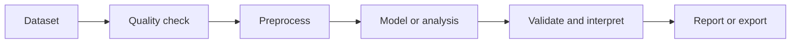

# Templates

Templates are runnable workflow starters. A good template is not just a graph of nodes; it is a scientific story with an input, a processing path, a primary plot or metric, and a next decision.

Use templates when you want to move quickly from a dataset to a defensible first result. After the first run, edit the workflow: change preprocessing, adjust model settings, add validation nodes, or replace the starter data with your own imported dataset.

## Strong First Templates

| Template family | Use it when | Primary output | What to decide next |
| --- | --- | --- | --- |
| PCA exploratory analysis | You need to understand sample structure before modeling | Scores, loadings, explained variance, diagnostics | Whether preprocessing and sample grouping make scientific sense |
| PLS calibration | Spectra have quantitative reference values | Predicted vs measured, RMSEP/R2/bias, VIP, coefficients | Whether validation design and target alignment are trustworthy |
| Representative or peak-guided PLS | You want a compact calibration workflow with variable interpretation | Calibration metrics plus selected regions or peak-driven features | Whether the reduced model remains chemically plausible |
| KNN, PLS-DA, SIMCA | Samples have class labels or QC acceptance categories | Confusion matrix, class metrics, SIMCA acceptance diagnostics | Whether class design, rejects, and holdout samples are appropriate |
| MCR-ALS | Mixtures contain overlapping spectral components | Resolved spectra, concentration-like profiles, lack-of-fit | Whether the resolved components are chemically defensible |
| Peak ID and Compare vs Library | You need local spectral features, tentative assignments, or reference-spectrum evidence | Peak table, AI-labeled assignment draft, HQI/cosine library ranking | Whether peaks, assignments, and library matches agree with sample chemistry and metadata |

## How to Read a Template Page

Each template page explains:

- expected input data and metadata
- the end-to-end workflow path
- the plots, tables, metrics, and artifacts it should produce
- how a scientist should review the result
- common failure modes before using the output in a report

The repository may contain templates marked `wip`. They should not be treated as production onboarding paths until their data source, plots, metrics, and story are verified.

Peak ID and Compare vs Library are described as a template family because they
are often assembled from the Peak Detection starter, reference-library data
nodes, and the Compare vs Library node. See [Peak ID and Library
Comparison](peaks-library.md) for the end-to-end interpretation path.
