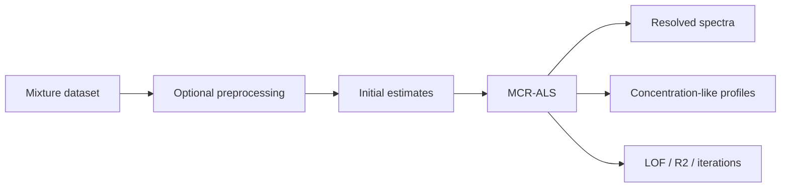

# MCR-ALS Starter

Use MCR-ALS when mixture spectra contain overlapping components and you want resolved spectra and concentration-like profiles.

## When To Use It

Use MCR-ALS when the measured spectra are mixtures and you need to estimate underlying component spectra and how those components vary across samples or time. It is most useful when PCA suggests a small number of latent components but the loadings are not directly interpretable as pure spectra.

Good starting data:

- mixture spectra with a consistent axis
- a plausible number of components
- chemical constraints or references when available
- enough sample variation for components to separate

## End-to-End Workflow

1. Import mixture spectra and inspect axis, sample order, and metadata.
2. Run PCA or a decomposition starter first to estimate the likely number of components.
3. Choose MCR-ALS component count and constraints based on chemistry, not only fit quality.
4. Run the template and inspect resolved spectra and profiles together.
5. Review lack-of-fit, R2, and iteration behavior to judge whether the model converged sensibly.

## What It Does

- loads mixture spectra
- optionally preprocesses the data
- fits an MCR-ALS model
- displays resolved spectra and profiles
- reports lack of fit and reconstruction diagnostics when surfaced by the workflow

## What to Inspect

- **Resolved spectra**: component-like spectral signatures. Compare peak positions and shapes with references when possible.
- **Concentration-like profiles**: relative contribution of each component across samples, time, or process condition.
- **Lack of fit (LOF)**: reconstruction error relative to the measured data. Lower is better, but low LOF alone does not prove chemical truth.
- **R2 and iterations**: fit quality and convergence behavior.
- **Residuals**: systematic residuals can indicate missing components, wrong preprocessing, saturation, or axis problems.

## Interpretation and Failure Modes

MCR-ALS is exploratory unless constrained by chemistry, references, or known profiles. Use it to propose component structure, then validate with independent evidence.

Common failure modes:

- too few or too many components
- components swapped or split across similar spectra
- profiles that fit mathematically but are chemically impossible
- baseline or scatter effects treated as chemical components
- convergence to a local solution that changes with initialization

## Next Step

If the resolved spectra are plausible, compare them with known references, NIST/HITRAN-derived spectra where appropriate, or independent laboratory evidence. If not, revisit preprocessing, component count, constraints, and sample design.
