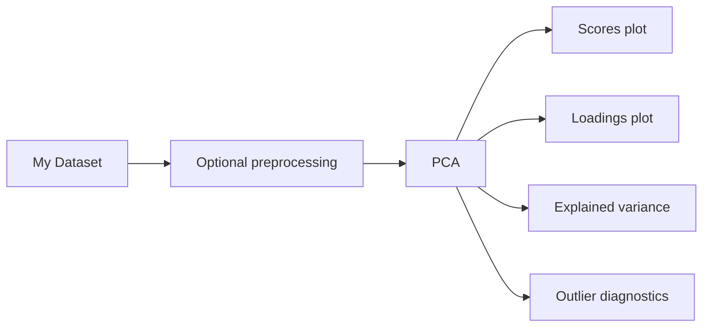

# PCA Starter

Use the PCA starter as the first workflow for most spectral datasets.

## When To Use It

Use PCA when you have spectra but are not ready to build a supervised model. PCA is the fastest way to see whether samples cluster by known factors, whether there are outliers, whether preprocessing helped, and which spectral regions drive the largest variation.

Good starting data:

- FTIR, NIR, Raman, or UV-VIS spectra with a consistent axis
- sample labels, batch labels, material classes, or acquisition metadata when available
- enough samples to see group structure rather than a single spectrum

## End-to-End Workflow

1. Load a dataset from **Data > Import** or select a bundled starter dataset.
2. Confirm the **Files**, **Metadata**, and **Data Matrix** panels before running the template.
3. Run the PCA template with a small number of components, usually 2 to 5 for first inspection.
4. Inspect scores first, then loadings, then explained variance and diagnostics.
5. Change preprocessing and rerun only if the first plot is dominated by baseline, scatter, scale, or obvious acquisition artifacts.

## What It Answers

- Do samples cluster?
- Are there obvious outliers?
- Did preprocessing help?
- Which spectral regions drive the main variation?
- Are replicate spectra behaving like replicates?
- Is there a batch, instrument, or acquisition effect worth investigating?

## What to Inspect

- **Scores plot**: sample-to-sample structure. Color by class, batch, instrument, operator, date, or concentration when metadata is available.
- **Loadings plot**: spectral variables responsible for the score directions. Check whether the peaks/regions make chemical sense.
- **Explained variance**: how much variation each component captures. Do not treat high explained variance alone as proof of a useful model.
- **T2/Q diagnostics**: leverage and residual structure. Outliers are prompts for investigation, not automatic deletion.

## Common Failure Modes

- Axis mismatch across files creates artificial structure.
- Replicate spectra from the same sample are treated as independent samples without intention.
- A batch or instrument effect overwhelms the chemistry of interest.
- Mean-centering or scaling is inappropriate for the question.
- The loadings highlight noise or baseline artifacts rather than interpretable spectral features.

## Next Step

If PCA reveals stable clusters or gradients tied to known metadata, move to PLS calibration or classification. If it is hard to interpret, return to data import and preprocessing before moving to supervised modeling.
