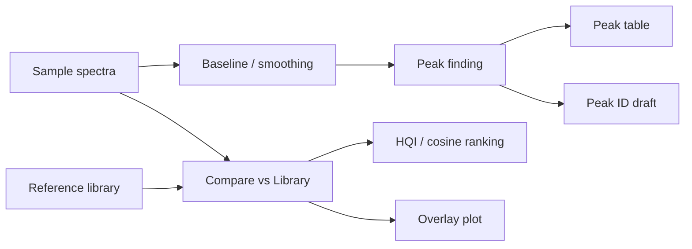

# Peak ID and Library Comparison

Use this interpretation path when you want to connect spectra back to local
bands, tentative chemical assignments, and reference-spectrum evidence.

Peak workflows are especially useful for FTIR, NIR, Raman, and UV-VIS work
where a scientist needs to ask: which bands are present, are they repeatable,
and do they agree with a known reference?

## When To Use It

Use Peak ID and Compare vs Library after you have already confirmed that the
sample spectra load correctly and the spectral axis is trustworthy.

Good starting data:

- spectra with a consistent wavenumber, wavelength, or Raman-shift axis
- enough baseline correction or smoothing to make peaks meaningful
- sample names, material identity, process state, or suspected components
- a reference library that covers the expected chemistry and axis range

## End-to-End Workflow

1. Import spectra and inspect **Files**, **Metadata**, and **Data Matrix**.
2. Apply only the preprocessing needed to make local bands interpretable.
3. Run Peak Finding and review the annotated spectrum before using the table.
4. Use Peak ID when you want a labeled interpretation draft for major peaks.
5. Run Compare vs Library against a relevant reference set.
6. Inspect overlays and diagnostic bands before accepting a match.
7. Carry the peak table, library ranking, and caveats into the report.

## What Peak Finding Provides

Peak Finding detects local maxima and summarizes consensus bands across one or
more spectra.

Primary outputs:

- peak position on the spectral axis
- median height and height IQR
- FWHM-like width estimate and width IQR
- integrated area estimate and area IQR
- detection count and detection rate across spectra
- annotated spectrum for visual review

These values are screening and interpretation features. They are not a
substitute for a fitted physical peak model when overlapping bands, shoulders,
saturation, or strong baseline curvature matter.

## What Peak ID Adds

Peak ID sends a selected peak list to the configured AI assistant and asks for
tentative vibration assignments. It is useful when a scientist wants a first
pass through common functional-group or compound-specific bands without leaving
the workflow.

Treat Peak ID output as labeled AI assistance:

- it should be checked against the spectrum, metadata, and references
- it should not invent assignments for omitted weak peaks
- it should not be used as proof of identity by itself
- it is most helpful when the suspected compound, material family, or sample
  context is supplied

## What Compare vs Library Adds

Compare vs Library ranks sample spectra against reference spectra using
similarity metrics and overlap checks. It is strongest when the reference
library is scientifically appropriate for the sample type, phase, axis range,
and preprocessing.

Primary outputs:

- HQI-style ranking table
- cosine similarity or related similarity scores
- overlap coverage and diagnostic-band checks
- sample/reference overlay for visual inspection
- metadata for the reference source

The ranking is evidence to inspect, not automatic compound identification. A
high score is less convincing when diagnostic bands are missing, the overlap is
small, preprocessing is mismatched, or the library does not cover plausible
alternatives.

## What To Inspect

- **Axis agreement**: units, direction, range, and interpolation behavior.
- **Diagnostic bands**: whether the chemically important bands are present.
- **Peak shape**: shoulders, saturation, clipping, and broad baselines.
- **Reference provenance**: where the reference spectrum came from and whether
  it should be cited.
- **Negative evidence**: expected bands that are absent are often as important
  as matched bands.
- **Mixtures**: multiple species can make one-library-match rankings look
  deceptively good or bad.

## Common Failure Modes

- A baseline artifact or noise spike is treated as a chemical peak.
- A library reference is compared outside its meaningful axis range.
- A single intense band dominates the overlay while weaker diagnostic bands do
  not match.
- The sample is a mixture, but the library ranking is interpreted as a single
  pure identity.
- AI-generated Peak ID text is copied into a report without scientific review.

## Next Step

If Peak ID and library comparison agree with the spectrum, use the result to
guide a report, a targeted library search, a reference overlay, or a follow-up
calibration/classification workflow. If they disagree, return to preprocessing,
check the axis and metadata, broaden the reference library, or inspect mixture
behavior with MCR-ALS.
