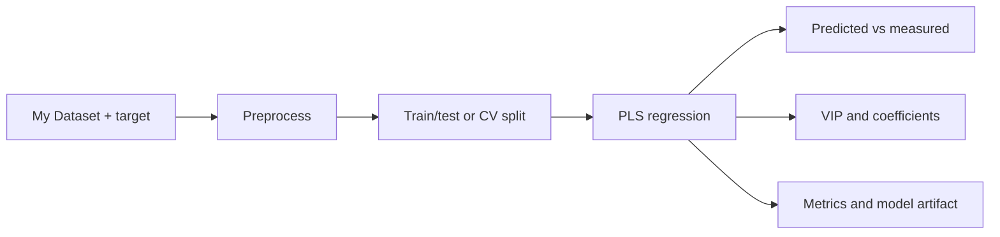

# PLS Calibration Starter

Use the PLS calibration starter when spectra have quantitative target values.

## When To Use It

Use PLS regression when each spectrum has one or more quantitative reference values: concentration, property value, blend ratio, moisture, octane, or another lab-measured target. The template is appropriate for FTIR, NIR, Raman, or UV-VIS calibration when spectra and reference values can be aligned by sample.

Good starting data:

- spectra with a consistent axis
- numeric target values with units
- sample IDs that can be used to verify target alignment
- a validation design that respects replicates, batches, time order, or sample groups

## End-to-End Workflow

1. Import spectra and target values, then verify that sample IDs and row order agree.
2. Inspect the data matrix before training. Confirm axis units, target units, and sample count.
3. Run the starter model with conservative component settings.
4. Review validation metrics and predicted-vs-measured plots before looking at interpretation plots.
5. Use VIP scores, regression coefficients, and residual patterns to decide whether the model is chemically plausible.
6. Save a model artifact only after validation design, preprocessing, and target alignment are defensible.

## What It Does

- loads a spectra-plus-target dataset
- preprocesses or scales as configured
- trains a PLS regression model
- reports holdout or cross-validation metrics
- exposes interpretation outputs such as VIP scores and coefficients

## What to Inspect

- **Predicted vs measured**: look for slope bias, curvature, clusters by batch, and high-leverage samples.
- **RMSEP/RMSECV, R2, bias, SEP**: read metrics in the context of the target units and intended decision threshold.
- **VIP scores**: identify spectral regions that influence the model. VIP is a guide, not a chemical assignment.
- **Regression coefficients**: check whether sign and shape agree with expected chemistry.
- **Residuals**: inspect whether errors concentrate by class, concentration range, instrument, or acquisition day.

## Before Trusting the Metric

Confirm target alignment, sample IDs, replicate grouping, and units. A calibration model can look good for the wrong reason if spectra and reference values are mismatched.

Also check:

- cross-validation folds do not split true replicates across train and test by accident
- preprocessing is fit only from training data when the model is intended for prediction
- the target range in validation covers the intended use range
- selected spectral regions correspond to real spectral information, not leakage or metadata artifacts

## Next Step

If the model is plausible, export the report and save the model artifact. If the model is not plausible, return to PCA, inspect outliers and batches, revise preprocessing, or improve the calibration set before adding more modeling complexity.
